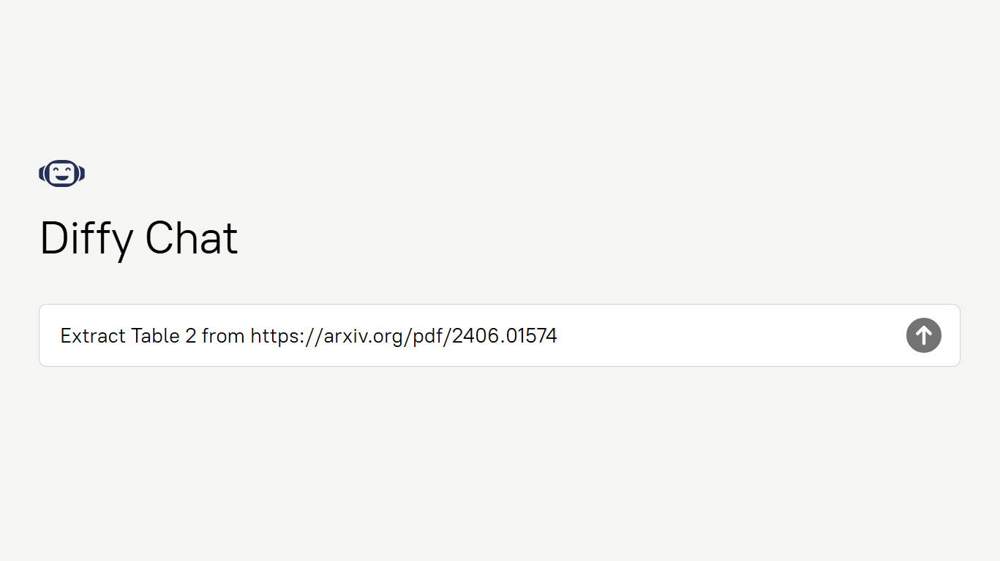
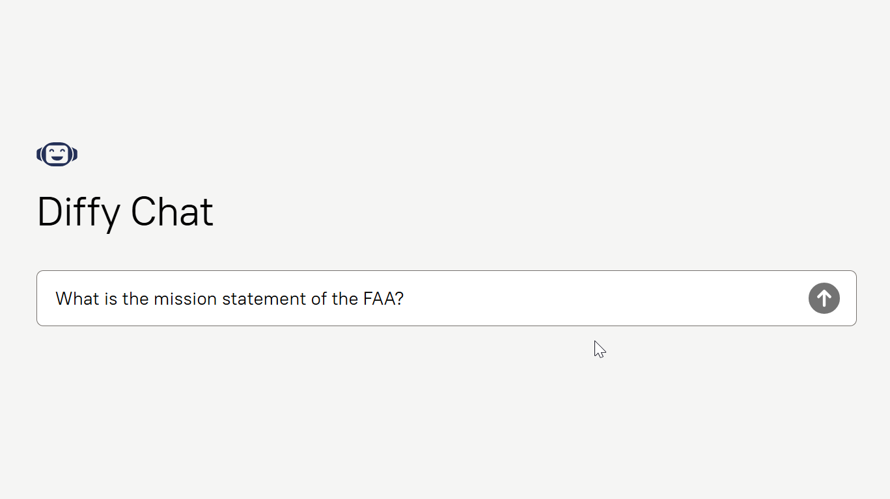
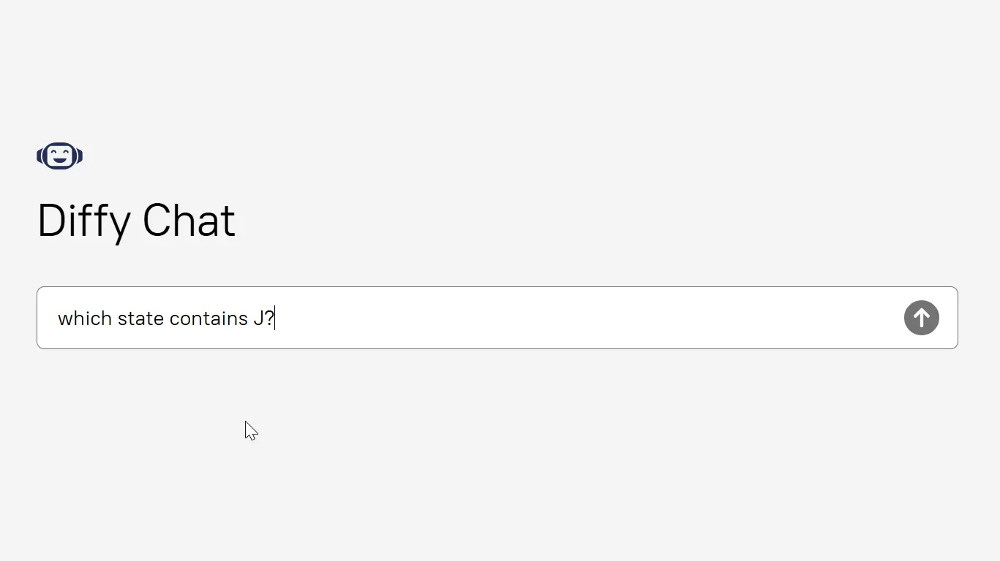
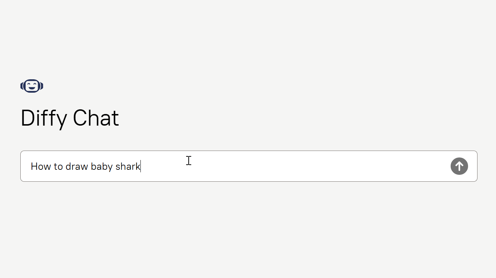
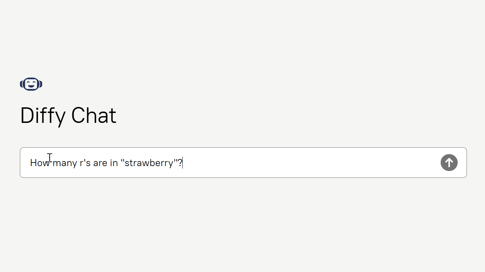
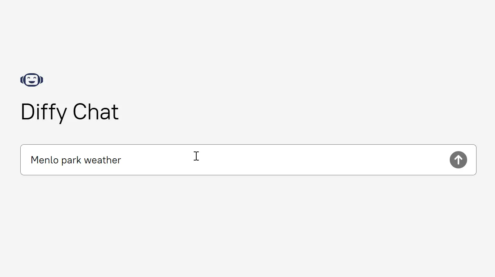

# Diffbot GraphRAG LLM

## 1. Introduction

Recently, large language models (LLMs) have been trained with more and more data, leading to an increase in the number of parameters and the compute power needed. But what if, instead of feeding the model more data, we purposefully trained it to rely less on its pretraining data and more on it's ability to find external knowledge?

To test this idea, we fine-tuned LLama 3.3 70B to be an expert tool user of a real-time Knowledge Graph API, providing the first open-source implementation of a GraphRAG system that outperforms Google Gemini and ChatGPT. 

## 2. Features

## Real-time web URL extraction



As a RAG system, Diffbot LLM can summarize a web document in real-time, appropriately crediting the original source.

## Expert Retriever of Factual citations



Diffbot LLM is explicitly trained to align the cited text with the reference source. 

## Knowledge Graph Querying



 Diffbot LLM is an expert tool user of the Diffbot (Knowledge Graph) Query Language.

## Image Entailment
 


 Diffbot LLM an also entail images. 

## Code Interpreter Tool Use




Instead of relying on the model weights for performing empirical calculations, Diffbot LLM is an expert tool user of a Javascript interpreter that it can use to inform it's response.


## Fun stuff



Diffbot LLM is an expert maker of ASCII-art weather forecasts, grounded in real sources.

## 3. Model Download

Available on HuggingFace at:
 * diffbot-small (8b Llama 3.1 fine tune): https://huggingface.co/diffbot/Llama-3.1-Diffbot-Small-2412
 * diffbot-small-xl (70b Llama 3.3 fine tune): https://huggingface.co/diffbot/Llama-3.3-Diffbot-Small-XL-2412

## 4. Accuracy Benchmarks

### FreshQA Dataset


[FreshQA](https://arxiv.org/abs/2310.03214) is a benchmark that measures real-time accuracy for search RAG systems.  Diffbot LLM outperforms gpt-4o (no web access), ChatGPT (with web access), Google Gemini, and Perplexity on real-time factual accuracy. 

In this evaluation, we focus on 130 FreshQA questions whose answer have changed in 2024, which is after the knowledge
cutoff for all evaluated models as of December 2024.

### MMLU-Pro

[MMLU-Pro](https://arxiv.org/abs/2406.01574) is a more difficult version of the [MMLU](https://arxiv.org/abs/2009.03300) benchmark that tests for static knowledge of 57 academic subjects using a 10-choice multiple-choice questions. [MMLU-Pro Leaderboard](https://huggingface.co/spaces/TIGER-Lab/MMLU-Pro).

Below shows the MMLU-Pro scores of diffbot-small and diffbot-small-xl over the base models it was fine-tuned from.

| Model | Accuracy (CoT 5-shot) |
| ----- | ----------------- |
| diffbot-small-xl | 72.89  |
| Llama-3.3-70B Instruct | 65.92 |

| Model | Accuracy (CoT 5-shot) |
| ----- | ----------------- |
| diffbot-small | 48.64 |
| Llama-3.1-8B Instruct | 44.25 |

Note: This is a measurement of the Diffbot GraphRAG LLM API end-to-end, not a measure of the knowledge contained in the weights. The lift in its performance over the base model comes from its ability to access external tools.


## 5. Demo

Try Diffbot LLM using the demo app at https://diffy.chat

## 6. Running Locally

Tested minimum hardware configurations: 

 - Nvidia A100 40G for diffbot-small
 - Nvidia 2XH100 80G for diffbot-small-xl @ FP8

Using Docker image and models in huggingface 
1. Pull docker image: `docker pull docker.io/diffbot/diffbot-llm-inference:latest`
2. Run docker image. **Note: The model weights will be automatically downloaded from huggingface. 
This might take a few minutes.**

Model: diffbot-small
```bash
docker run --runtime nvidia --gpus all -p 8001:8001 --ipc=host -e VLLM_OPTIONS="--model diffbot/Llama-3.1-Diffbot-Small-2412 --served-model-name diffbot-small --enable-prefix-caching --max-model-len 32768"  docker.io/diffbot/diffbot-llm-inference:latest 
```

Model: diffbot-small-xl
```bash
docker run --runtime nvidia --gpus all -p 8001:8001 --ipc=host -e VLLM_OPTIONS="--model diffbot/Llama-3.3-Diffbot-Small-XL-2412 --served-model-name diffbot-small --enable-prefix-caching --max-model-len 32768"  docker.io/diffbot/diffbot-llm-inference:latest 
```

You can now use the endpoint `http://localhost:8001/rag/v1`. It works exactly like the Serverless API below.

## 7. Using the Serverless API

Get a free Diffbot developer token at https://app.diffbot.com/get-started

```python
from openai import OpenAI

client = OpenAI(
    base_url = "https://llm.diffbot.com/rag/v1",
    api_key  = "<diffbot_token>" 
)

completion = client.chat.completions.create(
    model="diffbot-small-xl",
    temperature=0,
    messages=[
        {
            "role": "user",
            "content": "What is the Diffbot Knowledge Graph?"
        }
    ]
)
print (completion)
```
Contact support@diffbot.com if need more credits or higher limits.

## 8. Adding Custom Tools

To extend the Diffbot LLM Inference Server with new tools, please refer to [this tutorial](add_tool_to_diffbot_llm_inference.md).
